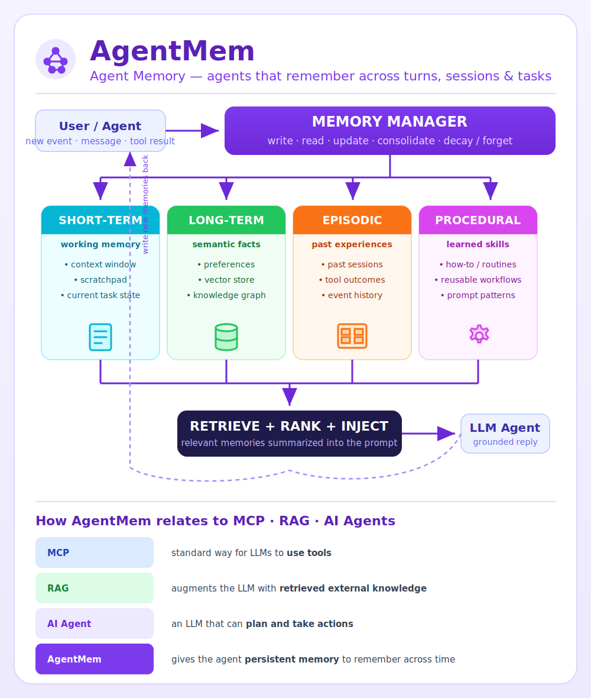

# 🧠 AgentMem (Agent Memory)

> **Agents that remember** — persistent state across turns, sessions, and tasks.

This is a companion to the classic **"MCP vs RAG vs AI Agents"** diagram. Those
three describe how an LLM *uses tools*, *retrieves knowledge*, and *takes
actions* — but none of them is **memory**. AgentMem is what lets an agent carry
context forward instead of starting fresh every time.



## Flow

```
                         ┌─────────────────────────────┐
   User / Agent  ──────► │        MEMORY MANAGER        │
   (new event)           │  write • read • update • forget
                         └───────────────┬─────────────┘
                                         │
        ┌──────────────┬─────────────────┼──────────────────┬──────────────┐
        ▼              ▼                 ▼                  ▼              ▼
  ┌──────────┐  ┌──────────────┐  ┌──────────────┐  ┌──────────────┐
  │SHORT-TERM│  │  LONG-TERM   │  │   EPISODIC   │  │  PROCEDURAL  │
  │ working  │  │ semantic     │  │ past events  │  │ learned      │
  │ memory   │  │ facts/prefs  │  │ & outcomes   │  │ skills       │
  └──────────┘  └──────────────┘  └──────────────┘  └──────────────┘
        └──────────────┴─────────────────┼──────────────────┴──────────────┘
                                         ▼
                              ┌────────────────────┐
                              │  RETRIEVE + INJECT  │ ──► relevant memories
                              │  (rank • summarize) │     added to the prompt
                              └────────────────────┘
```

## Memory types

| Type | What it holds | Typical store |
|------|---------------|---------------|
| **Short-term** (working) | context window, scratchpad, current task state | in-context buffer |
| **Long-term** (semantic) | facts, user preferences | vector DB + knowledge graph |
| **Episodic** | past sessions, tool outcomes, event history | event log / vector DB |
| **Procedural** | learned how-to, reusable workflows, prompt patterns | skill/template store |

## Key characteristics

- **Persistent state** — survives beyond a single context window or session
- **Write / read / update / forget** lifecycle (consolidation, decay, eviction)
- **Retrieve + rank + inject** relevant memories into the prompt at run time
- **Goal:** personalization, continuity, and learning from experience

## How AgentMem relates to the others

| Concept | What it does |
|---------|--------------|
| **MCP** | Standard way for LLMs to *use tools* |
| **RAG** | Augments the LLM with *retrieved external knowledge* |
| **AI Agent** | An LLM that can *plan and take actions* |
| **AgentMem** | Gives the agent *persistent memory* to remember across time |

---

*Diagram source: [`agentmem.svg`](./agentmem.svg) — rendered to [`agentmem.png`](./agentmem.png).*
